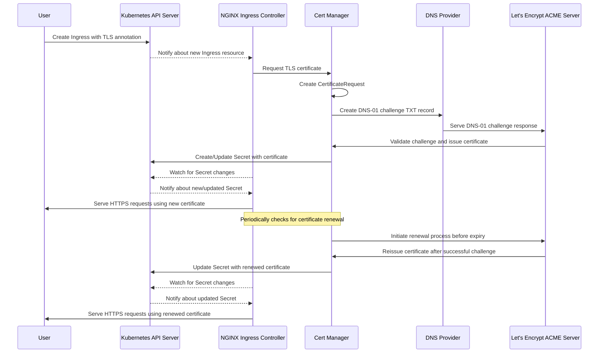

# Cert Manager Ingress Sequence Diagram

```mermaid
sequenceDiagram
    participant User
    participant K8sAPI as Kubernetes API Server
    participant Nginx as NGINX Ingress Controller
    participant CertMgr as Cert Manager
    participant DNS as DNS Provider
    participant LE as Let's Encrypt ACME Server

    User->>K8sAPI: Create Ingress with TLS annotation
    K8sAPI-->>Nginx: Notify about new Ingress resource
    Nginx->>CertMgr: Request TLS certificate
    CertMgr->>CertMgr: Create CertificateRequest
    CertMgr->>DNS: Create DNS-01 challenge TXT record
    DNS->>LE: Serve DNS-01 challenge response
    LE->>CertMgr: Validate challenge and issue certificate
    CertMgr->>K8sAPI: Create/Update Secret with certificate
    Nginx-->>K8sAPI: Watch for Secret changes
    K8sAPI-->>Nginx: Notify about new/updated Secret
    Nginx->>User: Serve HTTPS requests using new certificate

    Note over CertMgr, Nginx: Periodically checks for certificate renewal
    CertMgr->>LE: Initiate renewal process before expiry
    LE->>CertMgr: Reissue certificate after successful challenge
    CertMgr->>K8sAPI: Update Secret with renewed certificate
    Nginx-->>K8sAPI: Watch for Secret changes
    K8sAPI-->>Nginx: Notify about updated Secret
    Nginx->>User: Serve HTTPS requests using renewed certificate
```